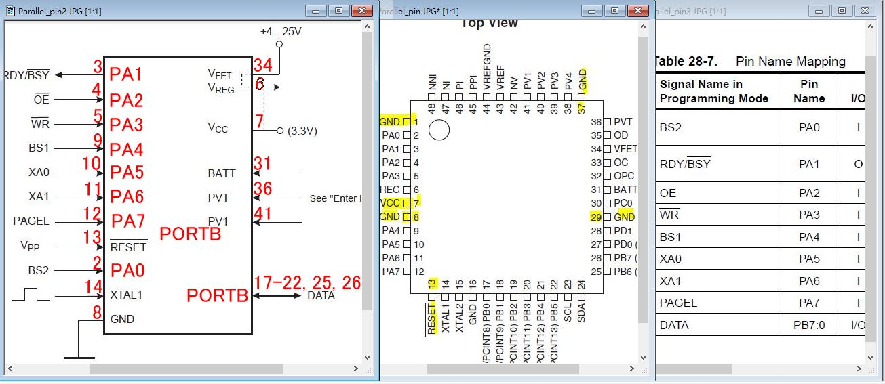

# ATmega406-SPHDV20

  
2010 notebook battery pack, Smart Battery Reference Design using the ATmega406

The Microchip today, APP NOTE and code example, according to Atmel, no license.

modifiy the code for hacking and project.

code, pdf, source, [https://www.microchip.com/DevelopmentTools/ProductDetails/PartNO/ATAVRSB100](https://www.microchip.com/DevelopmentTools/ProductDetails/PartNO/ATAVRSB100)

local cache.

component datesheet 
[6A2.pdf](6A2.pdf)  
[A4.pdf](A4.pdf)  
[AO3404.pdf](AO3404.pdf)  
[AO4407A.pdf](AO4407A.pdf)  
[ATmega406-typ_circuit.pdf](ATmega406-typ_circuit.pdf)  

  

JTAG pin  
  

Parallel ISP  
    
  
  
  
  

